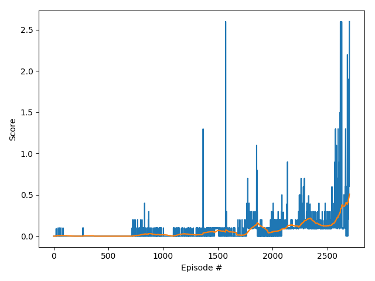

## Learning Algorithm
I used [Deep Deterministic Policy Gradient (DDPG)](https://arxiv.org/abs/1509.02971). 

DDPG features
- DDPG is actor-critic algorithm
- DDPG uses replay buffer
- DDPG uses target network
- DDPG softly updates a target network

### Model architecture
#### Actor model
- Input layer: 24
- Fully connected layer 1: 200 with ReLu activation function
- Fully connected layer 1: 100 with ReLu activation function
- Output layer: 2 with tanh activation function
#### Critic model
- Input layer: 24
- Fully connected layer 1: 200 + 2(action) with ReLu activation function
- Fully connected layer 1: 100 with ReLu activation function
- Output layer: 1

#### Hyperparameters
|hyperparameter|value|
|--|--|
|replay buffer size | 1e6 |
| minibatch size | 2048 |
| discount factor | 0.99 |
|soft update of target parameters | 1e-3 |
| learning rate of the actor | 1e-4 |
| learning rate of the critic | 1e-3 |
| learning every n step | 2 |
| lerning times in every learning step | 1 |

## Result
The DDPG solves in 2602 episodes.

## Future Work
- Tuning hyperparameters
- Try to other algorithms like PPO.